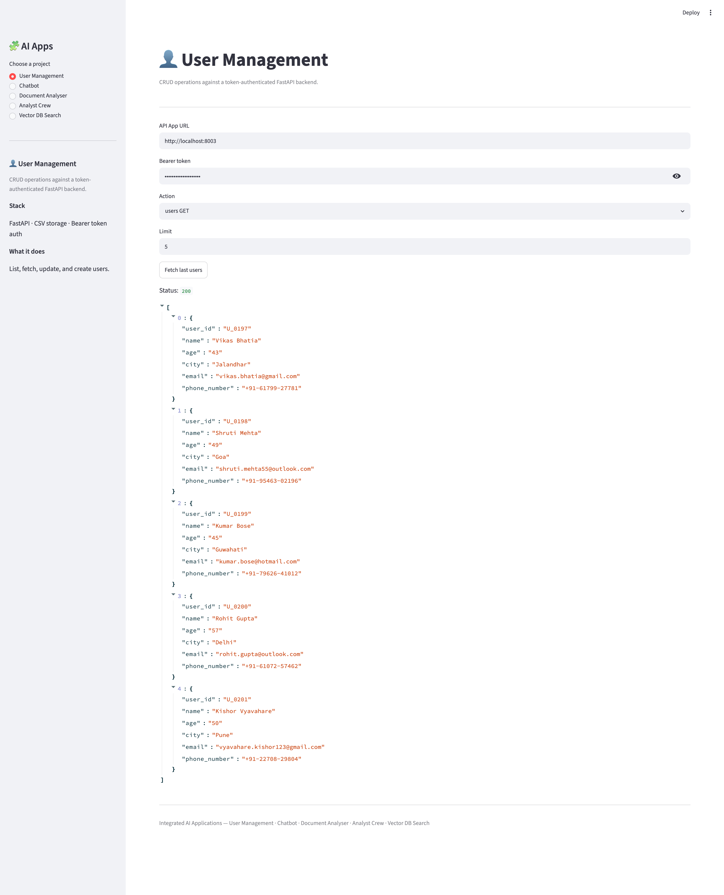
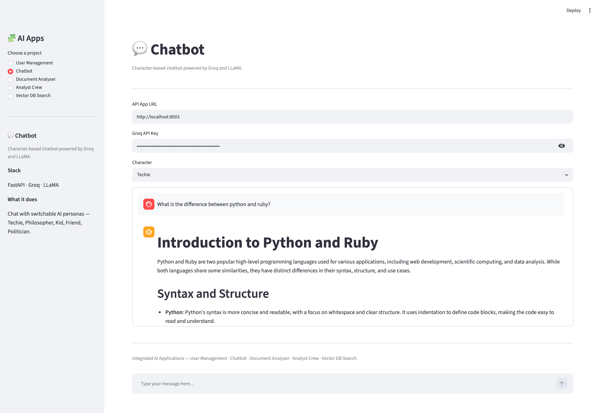
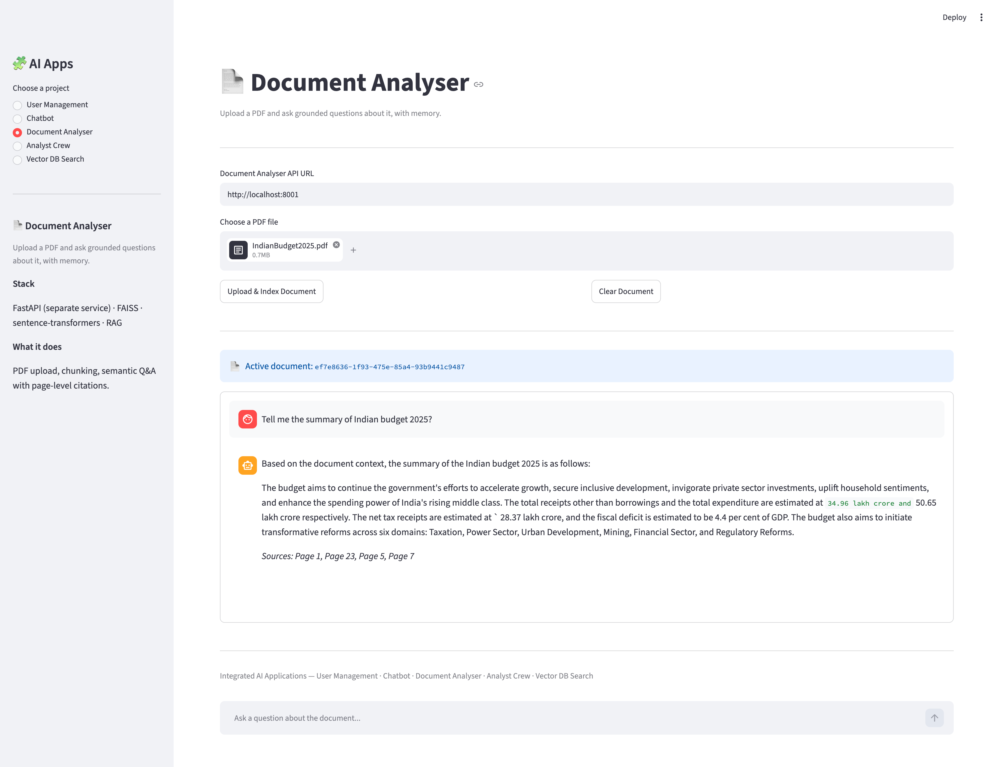
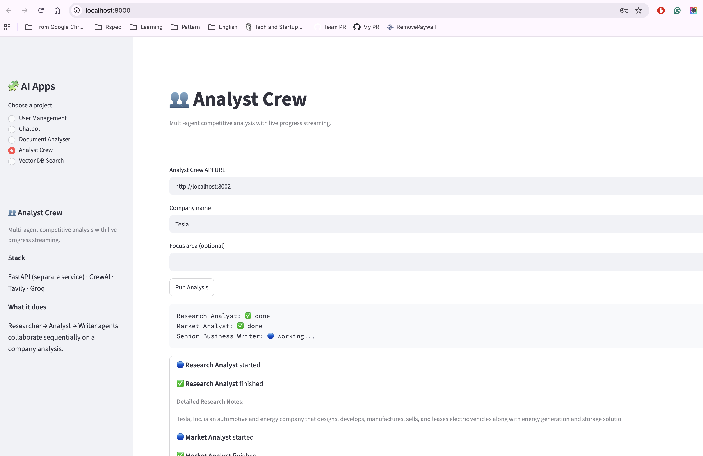
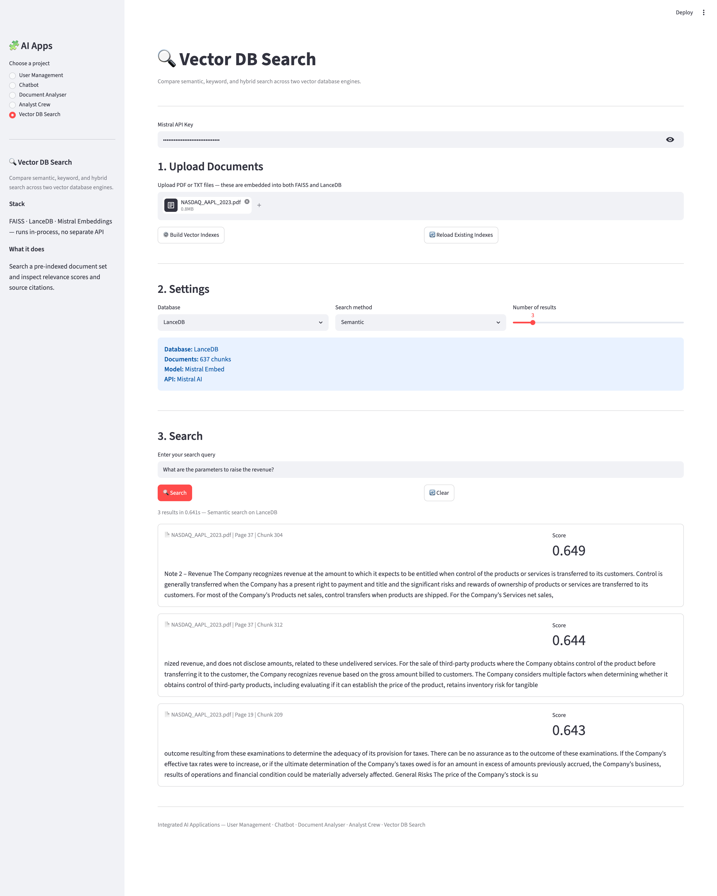
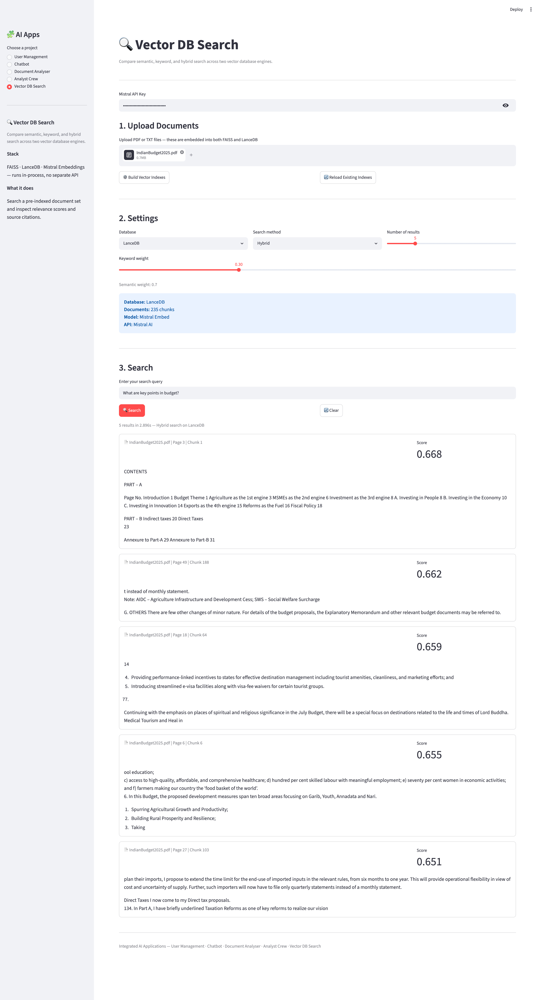

# 🧩 Streamlit Integrated AI Applications

> A single Streamlit interface unifying five independent AI/backend services — User Management, AI Chatbot, AI Document Analyser (RAG), a CrewAI Multi-Agent Analyst Crew, and a Vector Database Search Engine — most running as their own FastAPI microservice.


---

## 🎯 What This Is

Most demos show one AI feature in isolation. This repo shows something closer to how real products are built — a single frontend talking to multiple independent backend services and frameworks, each with its own responsibility and its own architecture.

```
Section 1 → User Management   → CRUD against this repo's own FastAPI backend
Section 2 → AI Chatbot         → Character-based chat — Groq/LLaMA
Section 3 → Document Analyser  → Upload a PDF, RAG-grounded Q&A — separate FastAPI service
Section 4 → Analyst Crew       → CrewAI multi-agent report generation — separate FastAPI service
Section 5 → Vector DB Search   → Build + query FAISS and LanceDB indexes — runs in-process
```

Navigation is a **sidebar radio**, not tabs — Streamlit's `st.tabs()` has no click event, so a radio list is used instead, with an info card above the content showing each section's description, stack, and purpose the moment it's selected.

Sections 1 and 2 talk to this repo's own backend (`app.py`). Sections 3 and 4 talk to **separate** FastAPI services — [ai-document-analyser](https://github.com/vyavahare-kishor/ai-document-analyser) and [ai-analyst-crew](https://github.com/vyavahare-kishor/ai-analyst-crew) — each on its own port. Section 5 runs FAISS/LanceDB **directly inside Streamlit**, no API call at all. This mix is intentional — it demonstrates both microservice and in-process architecture patterns in one project.

---

## 📸 Screenshots

**User Management**


**AI Chatbot**


**Document Analyser**


**Analyst Crew — live multi-agent progress**


**Vector DB Search — Semantic search**

Finds results by meaning — a query like "how does the system learn from data" matches chunks about model training even without shared keywords.

**Vector DB Search — Hybrid search**

Blends keyword matching with semantic similarity using adjustable weights — useful when exact terminology matters as much as meaning.

---

## ✨ Features

- Single Streamlit UI across five independent AI services and frameworks
- User CRUD — list, fetch, update, create users via a token-authenticated API
- Character-based chatbot — switch personas (Techie, Philosopher, Kid, Friend, Politician)
- PDF upload, RAG-grounded Q&A with page-level citations and conversation memory
- Multi-agent competitive analysis (CrewAI) with **live streamed progress** per agent
- Upload-your-own-documents vector search — builds FAISS and LanceDB indexes from PDFs/TXT on the fly
- Three search modes — Semantic, Keyword, and Hybrid (with adjustable weighting)
- Scrollable, auto-updating chat views using Streamlit's fixed-height container pattern
- Sidebar navigation with a live info card per section — description, stack, and purpose

---

## 🗂️ Project Structure

```
streamlit-ui-integrated-ai-prj/
├── app.py                 # FastAPI backend — user management + chatbot (port 8000)
├── user_management.py      # User CRUD logic
├── chatbot.py               # Chatbot logic
├── ui.py                    # Streamlit frontend — sidebar nav + 4 sections inline
├── vector_search.py         # Vector DB Search section — isolated for traceability
├── requirements.txt
├── user_db.csv
├── vector_dbs/               # FAISS index + LanceDB table (generated, not committed)
├── screenshots/              # README images
└── README.md
```

`vector_search.py` is deliberately separated from `ui.py` — it owns the full upload → chunk → embed → index → search pipeline for FAISS and LanceDB, and is imported into the sidebar dispatch with a single `vector_search.render()` call.

---

## 🚀 Getting Started

### Install

```bash
git clone https://github.com/vyavahare-kishor/streamlit-ui-integrated-ai-prj
cd streamlit-ui-integrated-ai-prj
pip install -r requirements.txt
```

### Configure

```bash
cp .env.example .env
```
```bash
GROQ_API_KEY=your_groq_api_key_here
MISTRAL_API_KEY=your_mistral_api_key_here
```

### Run all services

```bash
# Terminal 1 — this repo's backend (User Management + Chatbot)
uvicorn app:app --reload --port 8000

# Terminal 2 — ai-document-analyser (separate repo)
cd ../ai-document-analyser && uvicorn main:app --reload --port 8001

# Terminal 3 — ai-analyst-crew (separate repo)
cd ../ai-analyst-crew && uvicorn main:app --reload --port 8002

# Terminal 4 — Streamlit UI
streamlit run ui.py
```

Open the Streamlit URL it prints (usually `http://localhost:8501`). Vector DB Search works standalone — it needs only a Mistral API key, no extra service to run.

---

## 🧠 Vector DB Search — How It Works

Enter a Mistral API key, upload one or more PDF/TXT files, and click **Build Vector Indexes**. Behind the scenes: each file is extracted page by page (PyMuPDF for PDFs), split into overlapping 500-character chunks, embedded via Mistral's `mistral-embed` model in batches, then written to disk as **both** a FAISS flat-L2 index and a LanceDB table — so the same content is queryable through two different vector database engines side by side.

Switch between **Semantic** (pure vector similarity), **Keyword** (term overlap), and **Hybrid** (weighted blend of both) to compare how each ranks the same query. Every result cites its source file, page number, and chunk number.

---

## 🔗 Related Projects

This repo is one piece of a larger, continuously updated portfolio. The full journey — every project, in the order built, with what each one proves — lives here:

### 📖 [**ai-engineering-journey**](https://github.com/vyavahare-kishor/ai-engineering-journey) — start here

| Project | Description |
|---------|-------------|
| [**ai-native-journey**](https://github.com/vyavahare-kishor/ai-native-journey) | FastAPI foundation — REST API + AI chat + SSE streaming |
| [**ai-pr-reviewer**](https://github.com/vyavahare-kishor/pr-code-reviewer) | AI-powered GitHub PR code reviewer |
| [**ai-customer-support-bot**](https://github.com/vyavahare-kishor/ai-customer-support-bot) | RAG pipeline with pgvector |
| [**ai-research-agent**](https://github.com/vyavahare-kishor/ai-research-agent) | Autonomous single-agent ReAct reasoning — LangGraph |
| [**ai-document-analyser**](https://github.com/vyavahare-kishor/ai-document-analyser) | Conversational PDF analysis (used by this repo's Document Analyser section) |
| [**ai-analyst-crew**](https://github.com/vyavahare-kishor/ai-analyst-crew) | Multi-agent collaboration — CrewAI (used by this repo's Analyst Crew section) |
| **streamlit-ui-integrated-ai-prj** (this) | Unified frontend across all backend services, plus an in-process vector search engine |

---

## 👨‍💻 Author

**Kishor Vyavahare**
Senior Software Engineer → AI Native Engineer
11+ years backend engineering (Ruby on Rails, PostgreSQL, AWS). Now building production AI systems.

[](https://linkedin.com/in/vyavahare-kishor)
[](https://github.com/vyavahare-kishor)

---

## 📄 License

MIT License